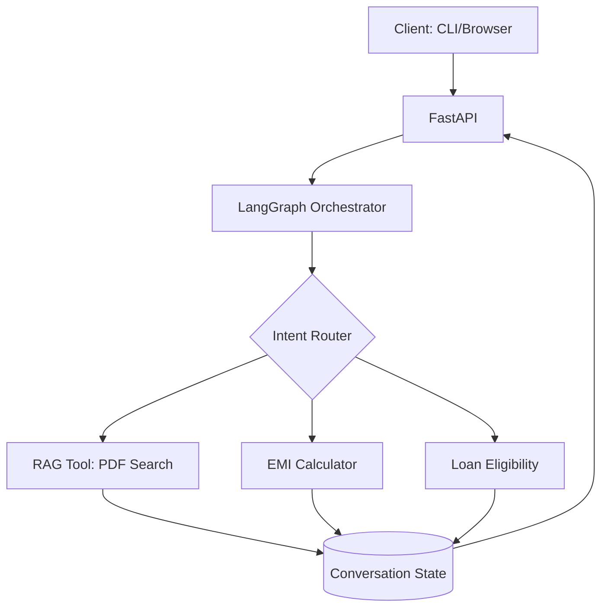

# Agentic RAG Loan Advisory Chatbot

A production-style **agentic AI system** that combines Retrieval-Augmented Generation (RAG), deterministic financial tools, and stateful conversation management using LangGraph.

This project demonstrates how to build a **tool-driven, interrupt-aware, session-based AI assistant** suitable for real-world financial advisory workflows.

---

## Key Features
- **Agentic Architecture**
  - Central supervisor orchestrates tool usage via LangGraph
  - Clean separation between reasoning, retrieval, and computation

- **RAG with Strict Grounding**
  - Answers generated only from provided PDF documents
  - Source-aware responses with hallucination prevention

- **Deterministic Financial Tools**
  - EMI calculation with amortization
  - Home loan eligibility assessment (soft sanction model)
  - No LLM-based math

- **Stateful Conversation Memory**
  - Slot-based memory (`ConversationState`)
  - Interrupt-aware flows
  - Session-scoped state with persistence hooks

- **LLM-Assisted Reasoning (Controlled)**
  - Intent routing
  - Slot extraction
  - Answer validation
  - No uncontrolled free-form reasoning

- **Multiple Interfaces**
  - FastAPI backend
  - CLI client
  - Minimal browser frontend

---

## High level architecture


---
## Why This Project Exists

Most RAG demos:
- Are stateless
- Use keyword-based intent detection
- Delegate math to LLMs
- Break on interruptions

This project intentionally solves those problems using:
- Explicit state
- Deterministic tools
- LLMs only where semantic reasoning is required
- Graph-based orchestration

---

## Tech Stack

- Python
- FastAPI
- LangGraph
- Google Vertex AI (Gemini)
- ChromaDB
- HTML (minimal frontend)

---

## How to Run (Local)
```
pip install -r requirements.txt
python app.py
```

```(For Command Line Interface)
python cli_app.py
```
OR
```(For HTML Interface)
uvicorn backend.app:app --reload 
```
Then open frontend.html in brwoser.

## Future Extensions
- Database-backed session persistence
- Authentication + OTP gating
- Multi-product expansion
- Streaming responses
- Production deployment (Docker / Cloud Run)

## Disclaimer
This system provides informational guidance only and is not a substitute for official financial advice or bank sanction processes.

## Author

Omkar Backend / AI Engineering Portfolio Project
